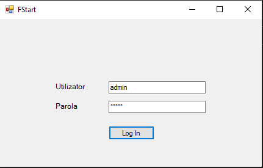
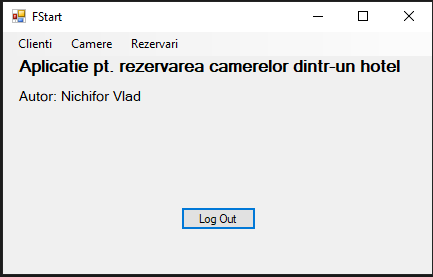
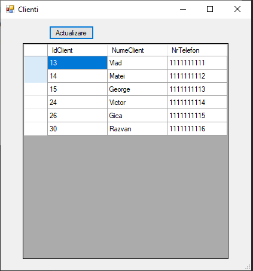
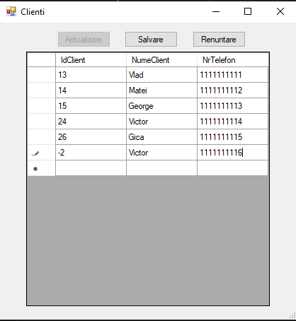
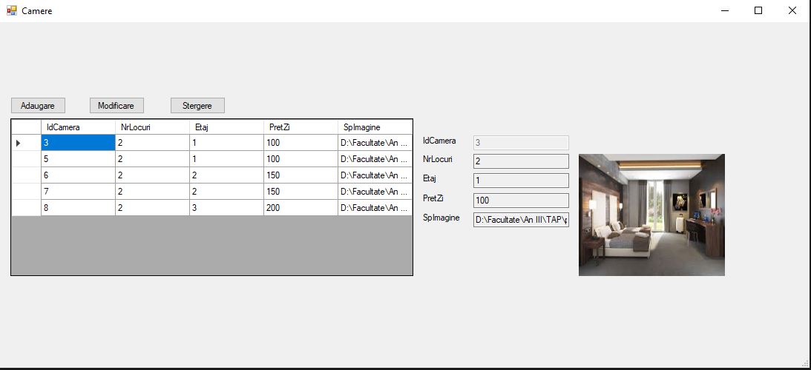
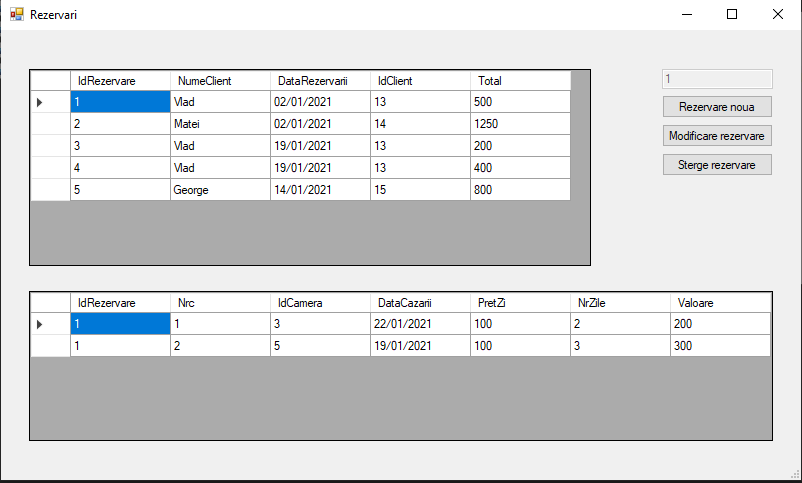
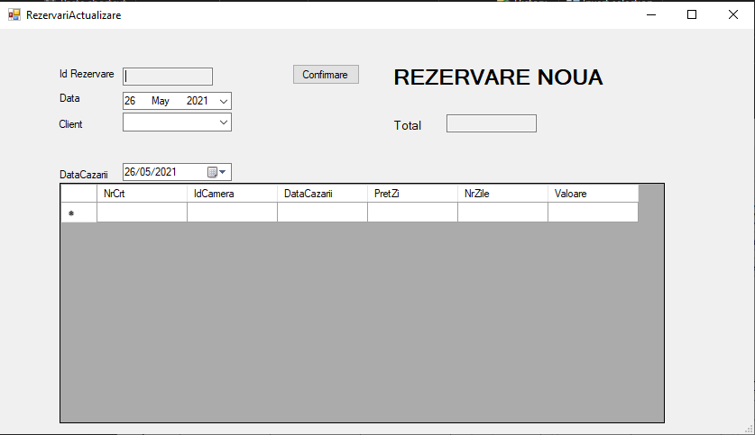
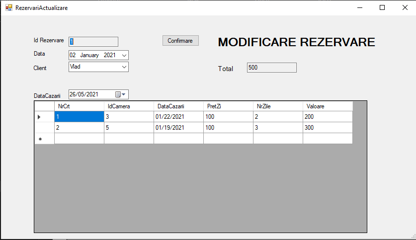

# Aplicatie pentru rezervarea camerelor dintr-un hotel
### Cuprins

- Descriere
- Cum functioneaza

## Descriere

Aplicatia are ca scop gestionarea rezervarilor dintr-un hotel.

## Tehnologii
- Limbajul C#
- Baza de date Access

## Cum functioneaza
Administratorul se logheaza in aplicatie si are acces la gestionarea clientilor, camerelor si rezervarilor.

### Imagini in timpul rularii

#### Vizualizare form logare

#### Vizualizare form clienti

#### Vizualizare form camere

#### Vizualizare form rezervari

#### Vizualizare form de adaugare/modificare rezervare

